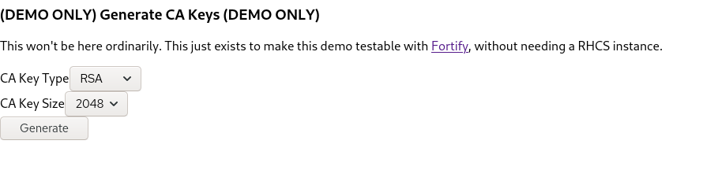
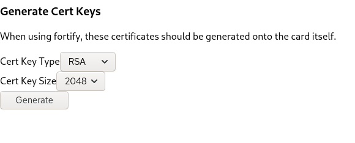
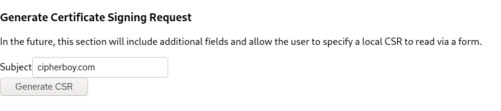
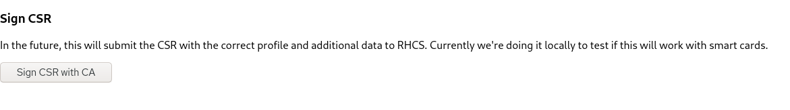
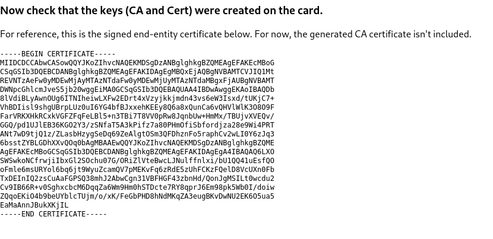

# Browser-side Key Generation using WebCrypto

The following demo is enclosed for testing purposes only.

I've tested on the following browsers:

 - Firefox 81 (64-bit) on Fedora 32
 - Chromium 85 (64-bit) on Fedora 32

Other browsers untested but likely supported.


The goal of this demo is to use WebCrypto APIs to generate keys. Ideally,
it should be tested with [Fortify](https://fortifyapp.com/) on a Windows
machine with a smart card setup. This could be used to test that keys are
actually generated on the card itself. This testing is beyond the scope of
what I can do.


To test, either:

  1. Serve the app/build directory locally such as with the following command:
    ```bash
    $ cd app/build && python3 -m http.server
    ```

  2. Or, if NodeJS is available, run:
    ```bash
    $ cd app && npm install
    $ cd app && npm start
    ```

Navigate to localhost on the relevant port (usually `8000` if using (1) or
`3000` if using (2)). Then, follow the prompts.

First, create a CA key. Note that this would not be done in a RHCS
environment. Select key type and size, then press the generate button.



Then, create the actual user keys. For now, enter the same details as with
the CA keys. Press the generate button.



Then, fill out CSR fields. For demo purposes the only field is `Subject`.
This will be expanded later. Then press "generate CSR". This simulates
sending the CSR to the CA for approval.



This next step is only required because we're doing this demo without
RHCS. Here, we sign the user's certificate with the CA's key. Press
sign CSR with CA.



Now, check that the keys (two key pairs) are created on the smart card.
Optionally, load the certificate in. Note that this is just the user's
certificate and does not contain the CA's certificate.




Please let us know if this works!
